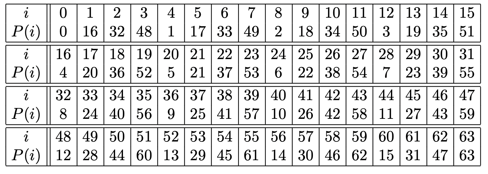

# Lab 4: Block Cipher

**Deadline: 13 Oct (2359)**

- [Lab 4: Block Cipher](#lab-4-block-cipher)
  - [Objectives](#objectives)
  - [PRESENT](#present)
    - [PRESENT Overview](#present-overview)
    - [Implementing PRESENT](#implementing-present)
  - [Implementing ECB Mode](#implementing-ecb-mode)
  - [Limitation of ECB Mode](#limitation-of-ecb-mode)
  - [Submission](#submission)
    - [eDimension Submission](#edimension-submission)

## Objectives

* Implement the ultra-lightweight PRESENT block cipher

## PRESENT

Read on PRESENT: an Ultra-lightweight Block Cipher:

* [http://yannickseurin.free.fr/pubs/Bogdanov_et_al07_CHES.pdf](http://yannickseurin.free.fr/pubs/Bogdanov_et_al07_CHES.pdf). This is a publication on PRESENT. 
* [http://www.emsec.rub.de/media/crypto/veroeffentlichungen/2011/01/29/present_ches2007_slides.pdf](http://www.emsec.rub.de/media/crypto/veroeffentlichungen/2011/01/29/present_ches2007_slides.pdf). This is a conference presentation on PRESENT.
* Read Netpbm image format [http://en.wikipedia.org/wiki/Netpbm_format](http://en.wikipedia.org/wiki/Netpbm_format)

You will be able to get all the needed information from the resources above. To aid you, some additional explanation is provided below.

### PRESENT Overview

* PRESENT is an example of an SP-network and consists of 31 rounds
(and 32 keys). SP refers to [substitution-permutation](https://en.wikipedia.org/wiki/Substitution%E2%80%93permutation_network).
* Each of the 31 rounds consists of XOR to introduce a round key, a non-linear substitution (S-Box) layer and a linear bitwise permutation (pLayer).
* Last (32nd) key is used at the end for [post-whitening](https://en.wikipedia.org/wiki/Key_whitening)

**S-Box**

* S-box: substitution-box aka performs substitution
* In PRESENT, number of input bits = number of output bits = 4
* S-box can be implemented as a fixed lookup table.
* Every word of 4 bits (a nibble) is substituted according to a fixed lookup table.
* [https://en.wikipedia.org/wiki/S-box](https://en.wikipedia.org/wiki/S-box)

**pLayer**

* Move bits around (permutation of bits) according to values given in a fixed table
* [https://en.wikipedia.org/wiki/Permutation_box](https://en.wikipedia.org/wiki/Permutation_box)

**Round Key**

* There are a series (key schedule) of 32 keys to be used in PRESENT, to be generated from the 80-bit input key
* The output of each round of key schedule is called round key (key of the round, get it?)
* Schedule for each round i:
  * Rotate left 80-bit key by 61 bits
  * Pass the 4 bits [79...76] through S-box
  * XOR the bits [19...15] with LSB of round_counter (i)
* "Add" round key refers to XOR with round key

**Decryption**

* Run PRESENT backwards to decrypt. This requires you to be able to invert or "undo" S-box, pLayer, and run the loop in the reverse order as well.

### Implementing PRESENT

* Use Python script `present.py` as a template to implement PRESENT block cipher with 80-bit key and 64-bit block length.
* You need to implement both the encryption and decryption portion.
* Check your result using Appendix 1 of the above linked paper. Note that `present.py` provides those test cases at the end of the file.

## Implementing ECB Mode

We are going to encrypt an image (`Tux.ppm`). Check if you are able to open it.

Your `present.py` in the previous section is for a plaintext of 64-bit length. 
In this section, you need to extend your code so that it can work with plaintext larger than 64-bit. 
Use Electronic Codebook Mode (ECB) method for this purpose.

Tasks

1. Use your ECB mode block cipher to encrypt the file `Tux.ppm`.
2. Decrypt the file and see whether you can still see the same image. 

Use `ecb.py` and run the file as the following:

```shell
python ecb.py -i [input filename] -o [output filename] -k [key filename] -m [mode]
```

## Limitation of ECB Mode

ECB mode reveals some side-channel information about the plaintext pattern in the ciphertext. 
In this section, we will try to learn information about the plaintext image from its ECB ciphertext.

1. Download `letter.e`. This is a secret image, encrypted in ECB mode, with a secret key.
2. Your task is to recover the plaintext of the original image.The image is stored in PBM format and has its header information stored in the file header.pbm (that is known to the attacker, i.e. you).
3. Write a Python script to extract the image pattern from letter.e. You can use `extract.py` as a starting point.

```shell
python extract.py -i [input filename] -o [output filename] -hh [known header file]
```

Hint: You can ignore the first few characters which represent the header as it has already been given. The plaintext PBM image is black and white, i.e. the format only has two values, either 0 or 1. You can assume that there is no space between the data values.

## Submission

### eDimension Submission

Submission ground rules:

* Please make sure to indicate your name and student ID in each of the graded submission files
* You are allowed to collaborate with **one** other student. If you choose to do so, both of your name/student ID should be indicated in the submission files. Both are still required to submit the files individually. 
* Except for within each pair of students that are collaborating, you are not allowed to share answers and solutions.

Lab 4 submission:

Upload a **zip file** with the following:

* `present.py`
* `ecb.py`
* `extract.py`
* Decrypted `letter.e`

**Deadline: 13 Oct (2359)**
